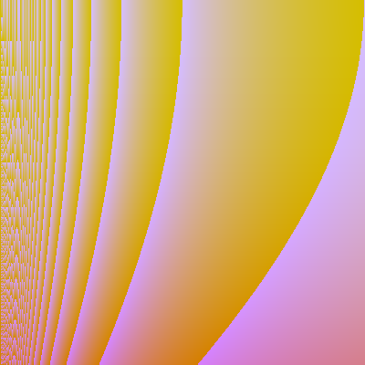

### This is just a fun project.

I saw this ``validation.pdf`` one of the [Tsoding Daily](https://www.youtube.com/@TsodingDaily)'s videos and just want to implement it in Golang.

**Example Image**

**Generated AST**

```c
vec3 (
  cos (
    cos (
      vec3 (
        cos (
          number:0.305797
        )
        sin (
          sin (
            div (
              cos (
                var_y
              )
              vec3 (
                var_x
                var_x
                number:0.613964
              )
            )
          )
        )
        sin (
          var_y
        )
      )
    )
  )
  less (
    mult (
      sin (
        if_then_else (
          if_then_else (
            var_x
            cos (
              sin (
                number:0.146308
              )
            )
            less (
              var_y
              sin (
                var_x
              )
            )
          )
          vec3 (
            var_y
            sin (
              less (
                number:0.923965
                number:0.600752
              )
            )
            cos (
              sin (
                var_x
              )
            )
          )
          cos (
            sin (
              cos (
                var_y
              )
            )
          )
        )
      )
      cos (
        sin (
          number:0.544332
        )
      )
    )
    cos (
      sin (
        var_x
      )
    )
  )
  vec3 (
    sin (
      number:0.694043
    )
    var_y
    less (
      number:0.210542
      cos (
        cos (
          number:0.020336
        )
      )
    )
  )
)
```
